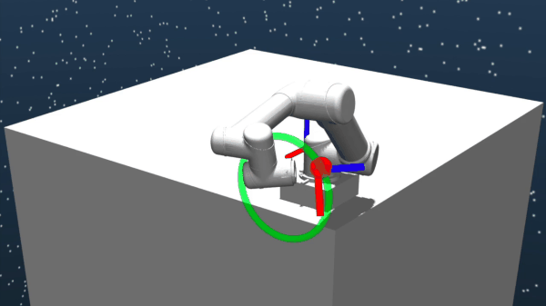
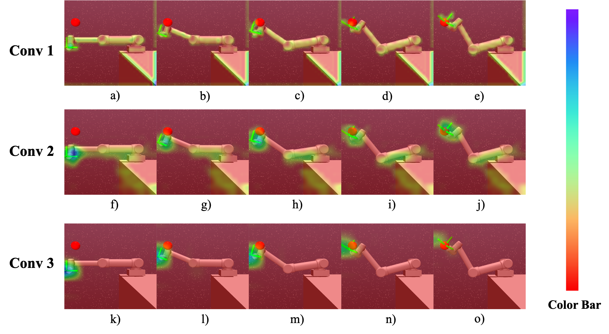

# SpaceRobotEnv

> Note: our repo can be found in the OpenAI Gym Documentation now. Please see [SpaceRobotEnv](https://www.gymlibrary.dev/environments/third_party_environments/#spacerobotenv).    

**SpaceRobotEnv** is an open-sourced environments for trajectory planning of free-floating space robots.
Different from the traditional robot, the free-floating space robot is a dynamic coupling system because of the non-actuated base, as shown in the figure below. 
Therefore, model-based trajectory planning methods encounter many dif- ficulties in modeling and computing. 


Accordingly, the researches focus on how to utilize the model-free methods, like reinforcement learning algorithms, to obtain the trajectory directly. 
However, reaching high-level planning accuracy, bimanual coordination and end-to-end control remains an open challenge for space robotics researchers.
To better help the community study this problem, SpaceRobotEnv are developed with the following key features:
* **Real Space Environment**: we construct environments similar to the space. The free-floating space robot is located in a low-gravity condition.
* **Dynamic coupling control**: Compared with robots on the ground, the torques of joints have a significant impact on the posture of the base. The movement of the base makes a disturbance on the positions of end-effectors, thus leading to a more complex trajectory planning task. 
* **Image input**: We provide the ability to use images as observations. And we also demonstrates our environment is effective, please see [our paper](https://ieeexplore.ieee.org/stamp/stamp.jsp?tp=&arnumber=9550509).   

- **Quick Demos**

[Paper link](https://ieeexplore.ieee.org/stamp/stamp.jsp?tp=&arnumber=9636681)
<div align=center>

</div> 

[Paper link](https://ieeexplore.ieee.org/stamp/stamp.jsp?tp=&arnumber=9636681)
<div align=center>

</div>

[Paper link](https://ieeexplore.ieee.org/stamp/stamp.jsp?tp=&arnumber=9550509)
<div align=center>

</div>  

Environments of this repo are as follows:
* **SpaceRobotState-v0**
    * State vector contains the angular positions and velocities of joints, the positions and velocities of end-effectors and the positions of goals. The core goal is to make the end-effector reach the goal randomly selected within a large space. 
* **SpaceRobotCost-v0**
    * The task is to make the end-effector reach a random goal while avoiding obvious movement of the base, especially for its orientation. Because the rotation of the base will cause the interruption of communication with the earth. 
* **SpaceRobotImage-v0**
    * State vector only contains images information. The core goal is the same as that of the `SpaceRobotState-v0` environment.
* **SpaceRobotDualArm-v0**
    * The free floating space robot owns two robotic arms which are attached with the base. That means two end-effectors are corresponding to two goal positions. 
    When two end-effectors reach the goals together, the task is finished. 
* **SpaceRobotReorientation-v0**
    * The free floating space robot owns two robotic arms which are attached with the base. The inital orientation of the base is sampled randomly in each episode. 
    When two arms help the base to reach the target orientation, the task is finished.     
* **SpaceRobotPointCloud-v0**
    * State vector contains the point colouds information. The core goal is the same as that of the `SpaceRobotState-v0` environment.

## Installation

Our environment is built on the [Mujoco Simulation](https://github.com/deepmind/mujoco). So before using our repo, please make sure you install the [Mujoco](https://github.com/deepmind/mujoco) platform.
Additionally, our framework is based on the [Gym](https://github.com/openai/gym).
Details regarding installation of Gym can be found [here](https://github.com/openai/gym).

After you finish the installation of the Mujoco and Gym and test some toy examples using them, you can install this repo from the source code:

```bash
pip install -e .
```

## Quick Start

We provide a Gym-Like API that allows us to get interacting information. `test_env.py` shows a toy example to verify the environments.
As you can see, A Gym-Like API makes some popular RL-based algorithm repos, like [Stable Baselines3](https://github.com/DLR-RM/stable-baselines3), easily implemented in our environments.
```python
import gym

import SpaceRobotEnv
import numpy as np

env = gym.make("SpaceRobotState-v0")

dim_u = env.action_space.shape[0]
print(dim_u)
dim_o = env.observation_space["observation"].shape[0]
print(dim_o)


observation = env.reset()
max_action = env.action_space.high
print("max_action:", max_action)
print("mmin_action", env.action_space.low)
for e_step in range(20):
    observation = env.reset()
    for i_step in range(50):
        env.render()
        action = np.random.uniform(low=-1.0, high=1.0, size=(dim_u,))
        observation, reward, done, info = env.step(max_action * action)

env.close()
```

## Introduction of free-floating space robot

The free-floating space robot contains two parts, a robotic arm and a base satellite. The robot arm is rigidly connected with the base, and the whole space robot remains in a low-gravity condition.
The 6-DoF UR5 model is chosen as the robot arm, and to simplify, we considered the base as a cubic structure. The specific structure is shown as follows.

<div align=center>

</div> 


## Future plan


### Tasks under development:  
  - [x] Point cloud inputs
  - [ ] Add new torque controllers, like impedance controller.
  - [ ] Bulid new environments

### Algorithms:
  - [x] PPO
  - [ ] TRPO
  - [x] DDPG
  - [ ] TD3
  - [x] SAC
  - [ ] HER
  - [ ] [HDO](https://ieeexplore.ieee.org/abstract/document/9718193)

## Citing SpaceRobotEnv

If you find SpaceRobotEnv useful, please cite our recent work in your publications. 

```
@article{wang2022collision,
  title={Collision-Free Trajectory Planning for a 6-DoF Free-Floating Space Robot via Hierarchical Decoupling Optimization},
  author={Wang, Shengjie and Cao, Yuxue and Zheng, Xiang and Zhang, Tao},
  journal={IEEE Robotics and Automation Letters},
  volume={7},
  number={2},
  pages={4953--4960},
  year={2022},
  publisher={IEEE}
}

@inproceedings{wang2021multi,
  title={A Multi-Target Trajectory Planning of a 6-DoF Free-Floating Space Robot via Reinforcement Learning},
  author={Wang, Shengjie and Zheng, Xiang and Cao, Yuxue and Zhang, Tao},
  booktitle={2021 IEEE/RSJ International Conference on Intelligent Robots and Systems (IROS)},
  pages={3724--3730},
  organization={IEEE}
}

@inproceedings{wang2021end,
  title={An End-to-End Trajectory Planning Strategy for Free-floating Space Robots},
  author={Wang, Shengjie and Cao, Yuxue and Zheng, Xiang and Zhang, Tao},
  booktitle={2021 40th Chinese Control Conference (CCC)},
  pages={4236--4241},
  year={2021},
  organization={IEEE}
}

@article{cao2022reinforcement,
  title={Reinforcement Learning with Prior Policy Guidance for Motion Planning of Dual-Arm Free-Floating Space Robot},
  author={Cao, Yuxue and Wang, Shengjie and Zheng, Xiang and Ma, Wenke and Xie, Xinru and Liu, Lei},
  journal={arXiv preprint arXiv:2209.01434},
  year={2022}
}

```  
  
## The Team

SpaceRobotEnv is a project maintained by 
[Shengjie Wang](https://github.com/Shengjie-bob), [Xiang Zheng](https://github.com/x-zheng16), [Yuxue Cao](https://github.com/ShenGe123000) , [Fengbo Lan](https://github.com/lanrobot) at Tsinghua University. Also thanks a lot for the great contribution from [Tosin](https://github.com/tohsin)  .


## License

SpaceRobotEnv has an Apache license, as found in the [LICENSE](LICENSE) file.
