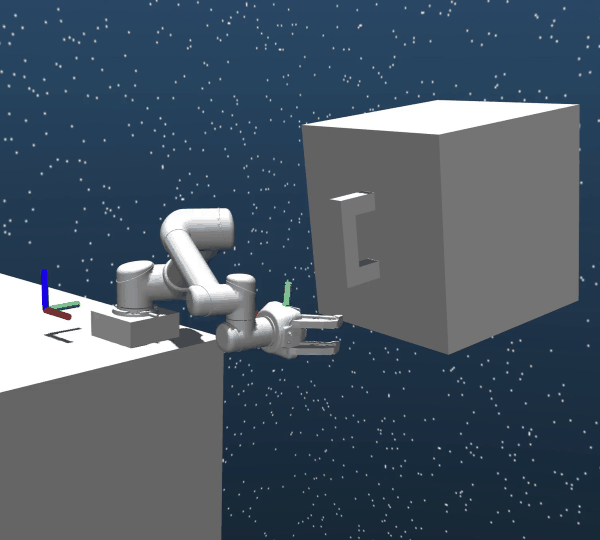

#SpaceRobotEnv
**SpaceRobotEnv** is an open-sourced environments for trajectory planning of free-floating space robots.
Different from the traditional robot, the free-floating space robot is a dynamic coupling system because of the non-actuated base, as shown in the [figure](#Introduction of free-floating space robot). 
Therefore, model-based trajectory planning methods encounter many dif- ficulties in modeling and computing. 

Accordingly, the researches focus on how to utilize the model-free methods, like reinforcement learning algorithms, to obtain the trajectory directly. 
However, reaching high-level planning accuracy, bimanual coordination and end-to-end control remains an open challenge for space robotics researchers.
To better help the community study this problem, SpaceRobotEnv are developed with the following key features:
* **Real Space Environment**: we construct environments similar to the space. The free-floating space robot is located in a low-gravity condition.
* **Dynamic coupling control**: Compared with robots on the ground, the torques of joints have a significant impact on the posture of the base. The movement of the base makes a disturbance on the positions of end-effectors, thus leading to a more complex trajectory planning task. 
* **Image input**: We provide the ability to use images as observations. And we also demonstrates our environment is effective, please see [our paper](https://ieeexplore.ieee.org/stamp/stamp.jsp?tp=&arnumber=9550509).   

- **Quick Demos**

[Paper link](https://ieeexplore.ieee.org/stamp/stamp.jsp?tp=&arnumber=9636681)

 

[Paper link](https://ieeexplore.ieee.org/stamp/stamp.jsp?tp=&arnumber=9636681)

[Paper link](https://ieeexplore.ieee.org/stamp/stamp.jsp?tp=&arnumber=9550509)

  

Environments of this repo are as follows:
* **SpaceRobotState-v0**
    * State vector contains the angular positions and velocities of joints, the positions and velocities of end-effectors and the positions of goals. The core goal is to make the end-effector reach the goal randomly selected within a large space. 
* **SpaceRobotImage-v0**
    * State vector only contains images information. The core goal is the same as that of the `SpaceRobotState-v0` environment.
* **SpaceRobotDualArm-v0**
    * The free floating space robot owns two robotic arms which are attached with the base. That means two end-effectors are corresponding to two goal positions. 
    When two end-effectors reach the goals together, the task is finished. 

## Installation

Our environment is built on the [Mujoco Simulation]() .
Additionally, we takes 
Details regarding installation of Gym can be found [here](https://developer.nvidia.com/isaac-gym).

## Introduction of free-floating space robot